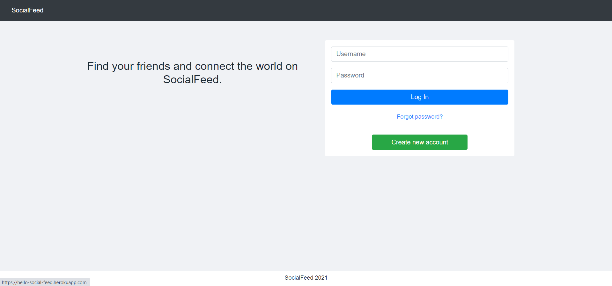
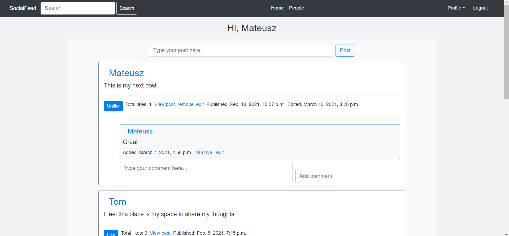
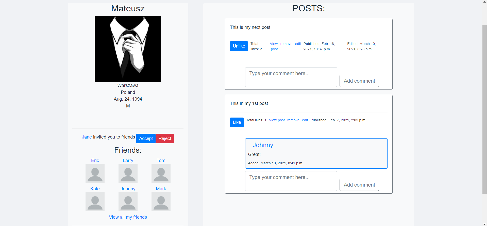
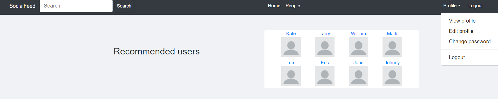

# SocialFeed - social media app

## Table of contents
* [General info](#general-info)
* [Technologies](#technologies)
* [Features](#features)
* [To do](#to-do)
* [Setup](#setup)

## General info

Simple social media app created with Django for educational purpose. My main focus was to consolidate knowledge acquired during doing tutorials, especially to create CRUD with accounts, write tests. App is created only by me.

## Technologies

 - Python 3.8
 - Django 3.1
 - PostgreSQL
 - Bootstrap 4
 - AWS RDS and S3
 - Heroku
 - Unittest
 
## Features

 - CRUD posts and comments
 - Adding/removing likes to posts
 - Sending, accepting and rejecting invitations
 - Updating profile
 - Deleting from friends
 - Registration
 - Changing / reseting password
 - Searching users
 - Adding profile picture
 - Pagination
 
## To do

 - Notifications about friends' actions
 - More advanced search and recommendations
 - User's picture gallery
 - Posting pictures, films etc on wall

## Setup 

Online demo: https://hello-social-feed.herokuapp.com/

Or if you want to check it on local machine:

Clone repo `git clone https://github.com/MateuszM-M/SocialFeed`,

Go to repo directory `cd SocialFeed`,

Create virtual environment `python -m venv venv`,

Activate environment `venv\scripts\activate`,

Install required packages `pip install -r requirements.txt`,

Rename MMblog/settings/ `.env-example` to `.env`,

Create local postgres database and type credentials in SocialFeed/settings/dev.py

Migrate database `python manage.py migrate`,

Load inital data `python manage.py loaddata fixtures/data.json`

Create superuser `python manage.py createsuperuser`,

Make server up and running `python manage.py runserver`,

Browse http://127.0.0.1:8000/
